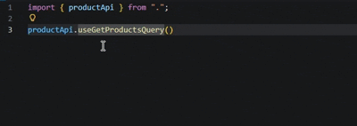

# rtk-to-endpoints

English | [简体中文](./README.zh-CN.md)

A TypeScript Language Service Plugin that enhances IDE experience for RTK Query by enabling "Go to Definition" from hooks directly to endpoint definitions.

<p align="center">
  
</p>

## Problem

When using RTK Query, hook names (e.g., `useGetUserQuery`) are dynamically derived from endpoint names (e.g., `getUser`). TypeScript's "Go to Definition" can only point to type gymnastics, not directly to the endpoint definition in `createApi`.

## Solution

This plugin intercepts the "Go to Definition" request, recognizes RTK Query hook naming patterns, and navigates directly to the corresponding endpoint definition.

## Installation

```bash
npm install --save-dev rtk-to-endpoints
```

## Configuration

### 1. Add plugin to `tsconfig.json`

```json
{
  "compilerOptions": {
    "plugins": [
      {
        "name": "rtk-to-endpoints"
      }
    ]
  }
}
```

### 2. Switch VSCode to use workspace TypeScript

This plugin requires VSCode to use your workspace's TypeScript version instead of the built-in one.

**Steps:**

1. Open Command Palette:
   - **Windows/Linux**: `Ctrl+Shift+P`
   - **macOS**: `Cmd+Shift+P`

2. Run command: **TypeScript: Select TypeScript Version**

3. Select **Use Workspace Version**

4. **Reload the VSCode window** (`Ctrl+Shift+P` / `Cmd+Shift+P` → **Developer: Reload Window**) for the changes to take effect.

## Usage

After configuration, when you use "Go to Definition" (F12 / Cmd+Click) on any RTK Query hook:

```typescript
// Clicking on useGetUserQuery will jump to the getUser endpoint definition
const { data } = useGetUserQuery();
```

### Multiple Jumps in Destructuring

This plugin does not recursively resolve assignments. If the hook name is assigned from elsewhere (e.g., via destructuring), you may need to jump multiple times:

```typescript
export const userApi = createApi({
  endpoints: (builder) => ({
    getUsers: builder.query<string, void>({
      // <- 2. Second jump lands here (endpoint definition)
      query: () => ''
    }),
  })
})

export const { useGetUsersQuery } = userApi
//               ^
//               |
// 1. First jump lands here (destructuring location)
//    Then jump again to reach the endpoint definition
```

Supported hook patterns:
- `use{Endpoint}Query`
- `useLazy{Endpoint}Query`
- `use{Endpoint}Mutation`
- `use{Endpoint}QueryState`
- `use{Endpoint}InfiniteQuery`
- `use{Endpoint}InfiniteQueryState`

## Requirements

- TypeScript >= 4.0.0

## License

MIT
