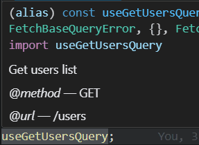

# rtk-to-endpoints

[English](./README.md) | 简体中文

一个 TypeScript 语言服务插件，通过实现从 RTK Query hook 到 endpoint 定义的"跳转到定义"功能，以及智能悬停提示，增强 IDE 开发体验。

<p align="center">
  
  &nbsp;
  
</p>

## 功能特性

- **跳转到定义**：从 RTK Query hook 直接跳转到对应的 endpoint 定义
- **跨文件支持**：支持从其他文件导入的 hook（支持跨一层导入）
- **重命名支持**：支持使用 `as` 别名导入的 hook（支持跨一层导入）
- **悬停提示**：鼠标悬停时显示 JSDoc 注释和 endpoint 详情（URL、HTTP 方法）

## 问题

使用 RTK Query 时，hook 名称（如 `useGetUserQuery`）是由 endpoint 名称（如 `getUser`）动态派生而来的。TypeScript 原生的"跳转到定义"只能指向类型体操代码，无法直接跳转到 `createApi` 中的 endpoint 定义处。

## 解决方案

该插件拦截"跳转到定义"请求，识别 RTK Query hook 命名模式，直接导航到对应的 endpoint 定义。同时提供丰富的悬停信息，显示 endpoint 详情。

## 安装

```bash
npm install --save-dev rtk-to-endpoints
```

## 配置

### 1. 在 `tsconfig.json` 中添加插件

```json
{
  "compilerOptions": {
    "plugins": [
      {
        "name": "rtk-to-endpoints"
      }
    ]
  }
}
```

### 2. 切换 VSCode 使用工作区 TypeScript

此插件需要 VSCode 使用工作区的 TypeScript 版本而非内置版本。

**操作步骤：**

1. 打开命令面板：
   - **Windows/Linux**: `Ctrl+Shift+P`
   - **macOS**: `Cmd+Shift+P`

2. 执行指令：**TypeScript: 选择 TypeScript 版本...** (或 "TypeScript: Select TypeScript Version")

3. 选择**使用工作区版本** (或 "Use Workspace Version")

4. **重新加载 VSCode 窗口**（`Ctrl+Shift+P` / `Cmd+Shift+P` → **开发人员: 重新加载窗口** / "Developer: Reload Window"）使配置生效。

## 使用

### 跳转到定义

配置完成后，在任何 RTK Query hook 上使用"跳转到定义"（F12 / Cmd+点击）：

```typescript
// 点击 useGetUserQuery 将跳转到 getUser endpoint 定义处
const { data } = useGetUserQuery();
```

### 跨文件导入

插件支持从其他文件导入的 hook（最多跨一层导入）：

```typescript
// api.ts
export const userApi = createApi({
  endpoints: (builder) => ({
    getUsers: builder.query({
      query: () => '/users'
    }),
  })
})
export const { useGetUsersQuery } = userApi

// component.ts
import { useGetUsersQuery } from './api'
//     ^ 这里可以跳转！
```

### 重命名导入

使用 `as` 别名导入的 hook 也支持跳转：

```typescript
import { useGetUsersQuery as useUsers } from './api'
//     ^ 这里也可以跳转！
```

### 悬停提示

鼠标悬停在 RTK Query hook 上可查看：
- endpoint 定义处的 JSDoc 注释
- HTTP 方法和 URL

```typescript
export const userApi = createApi({
  endpoints: (builder) => ({
    /**
     * 从 API 获取所有用户
     */
    getUsers: builder.query({
      query: () => '/users'  // 或: () => ({ url: '/users', method: 'GET' })
    }),
  })
})
```

悬停在 `useGetUsersQuery` 上将显示：
- "从 API 获取所有用户"
- Method: GET
- URL: /users

## 支持的 Hook 模式

- `use{Endpoint}Query`
- `useLazy{Endpoint}Query`
- `use{Endpoint}Mutation`
- `use{Endpoint}QueryState`
- `use{Endpoint}InfiniteQuery`
- `use{Endpoint}InfiniteQueryState`

## 要求

- TypeScript >= 4.0.0

## 许可证

MIT
